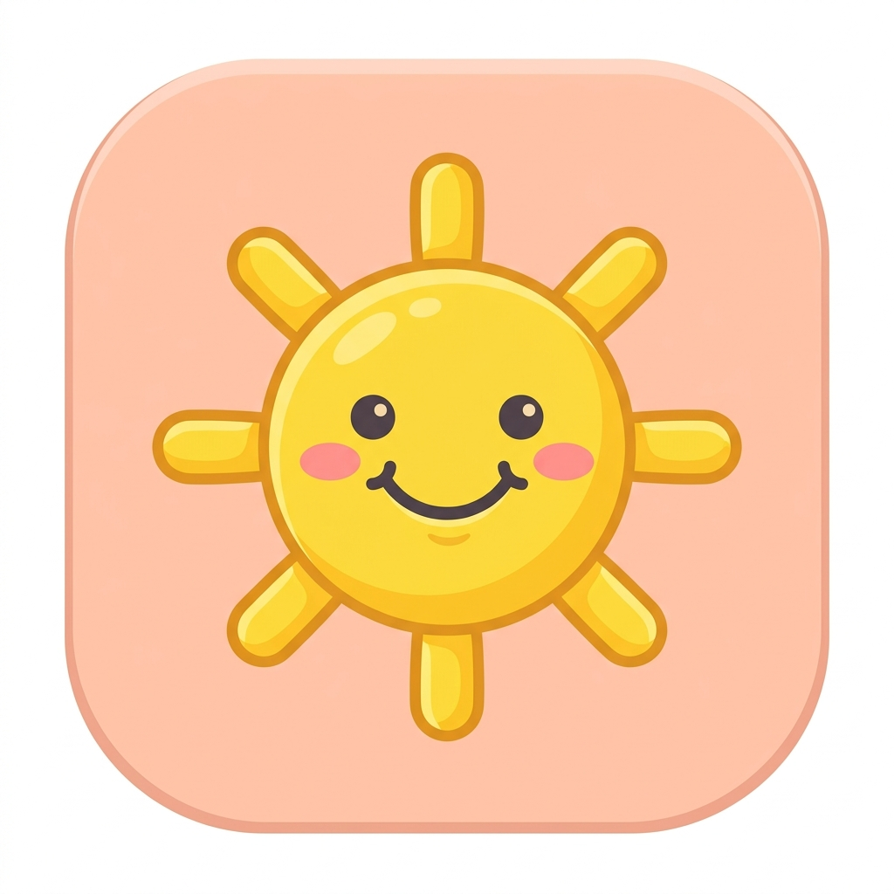
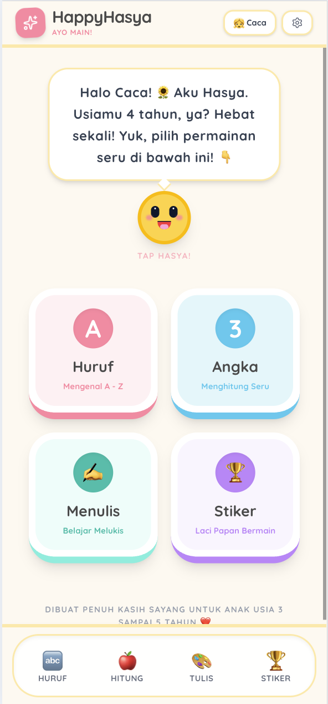
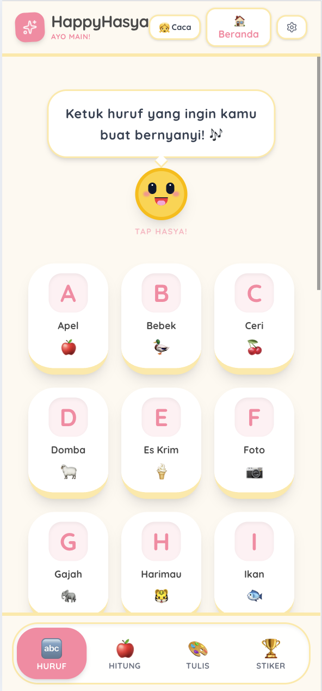
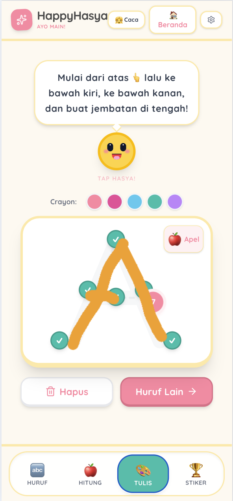
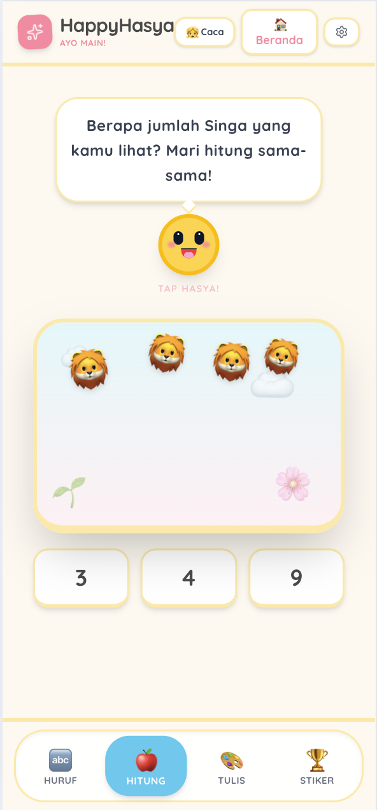

<div align="center">



# HappyHasya

**Aplikasi Belajar Interaktif untuk Anak Usia 3-5 Tahun**

Aplikasi edukatif berbasis web yang dirancang untuk membantu anak-anak belajar huruf, berhitung, menulis, dan mengumpulkan stiker hadiah — semua dalam bahasa Indonesia! 🎉

[](https://react.dev) [](https://typescriptlang.org) [](https://vitejs.dev) [](https://web.dev/progressive-web-apps/)

</div>

---

## Fitur Utama

### 🔤 Belajar Huruf (Alfabet)
Pelajari huruf A–Z lengkap dengan contoh kata, emoji, panduan pengucutan, dan suara dalam bahasa Indonesia. Anak-anak bisa mengetuk gelembung interaktif sambil belajar!

### 🍎 Bermain Hitung (Counting)
Permainan berhitung interaktif — hitung jumlah objek yang muncul di layar, pilih jawaban yang benar, dan dapatkan stiker hadiah sebagai reward!

### ✍️ Menulis / Menelusuri Huruf (Tracing)
Latihan menulis huruf dengan jari atau mouse di atas panduan garis titik-titik. Dilengkapi checkpoint dan pilihan warna krayon untuk pengalaman belajar yang menyenangkan.

### 🏆 Koleksi Stiker (Rewards)
Kumpulkan 22 stiker dari 4 kategori (hewan, makanan, benda, fantasi) dengan menyelesaikan berbagai aktivitas. Tempelkan stiker di playground yang interaktif!

---

## Tangkapan Layar

<table>
  <tr>
    <td align="center"><b>Beranda</b></td>
    <td align="center"><b>Belajar Huruf</b></td>
  </tr>
  <tr>
    <td></td>
    <td></td>
  </tr>
  <tr>
    <td align="center"><b>Menulis Huruf</b></td>
    <td align="center"><b>Bermain Hitung</b></td>
  </tr>
  <tr>
    <td></td>
    <td></td>
  </tr>
</table>

---

## Fitur Lainnya

- **Mascot Hasya** — Karakter animasi lucu yang menemani dan memberikan semangat
- **Text-to-Speech Indonesia** — Semua huruf, angka, dan instruksi dibacakan dalam bahasa Indonesia
- **Sound Effect Prosedural** — Efek suara dihasilkan via Web Audio API tanpa file audio eksternal
- **Sistem Achievement Stiker** — 22 stiker yang bisa dibuka dengan menyelesaikan berbagai misi
- **Profil Anak** — Personalisasi nama, usia, dan jenis kelamin anak
- **Dashboard Orang Tua** — Laporan perkembangan anak dilindungi gerbang matematis
- **Progress Persistence** — Semua data tersimpan di localStorage dan tetap ada meskipun aplikasi ditutup
- **PWA Support** — Bisa diinstall ke home screen dan berjalan offline
- **Responsif** — Mendukung perangkat mobile dan desktop

---

## Teknologi

| Teknologi | Keterangan |
|---|---|
| React 19 | Library UI |
| TypeScript | Bahasa pemrograman |
| Vite 6 | Build tool |
| Tailwind CSS 4 | Styling |
| Framer Motion | Animasi |
| Lucide React | Ikon |
| Web Audio API | Efek suara |
| Web Speech API | Text-to-speech |
| Cloudflare Pages | Deployment |

---

## Menjalankan

```bash
npm install
npm run dev
```

Buka `http://localhost:5173` di browser.

## Build & Deploy

```bash
npm run build
npx wrangler pages deploy dist
```

---

<div align="center">

Dibuat dengan ❤️ untuk anak-anak Indonesia

</div>
